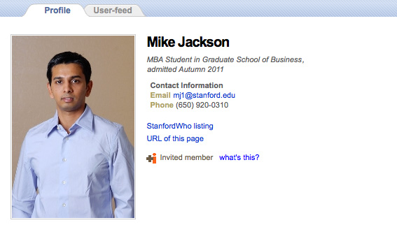

a) Crear el fichero alumnos.html

Ese fichero deberá contener una tabla de al menos 10 alumnos con  los datos personales de cada uno de ellos en cada una de las filas.

Los datos personales (columnas) que deberá tener la tabla son los siguientes: DNI, Nombre,Apellidos, Dirección, Teléfono y Correo Electrónico

Al hacer click en el DNI se pasará mediante GET un id (diferente para cada alumno) al fichero ficha.php

b) Crear el perfil.php

En el fichero perfil.php se mostará el perfil de cada alumno (dependiendo de en cuál haya hecho click).

El perfil deberá ser similar a la siguiente imagen:

NOTA: Los datos de los siguiente alumnos deberán estar almacenados en un array de arrays. De tal manera que el elemento 0 de ese array contendrá un array asociativo con los datos del alumno con id 0.

EJERCICIO 2: (en la carpeta ej2)

Vamos a simular un proceso de matricula. Para ellos crearemos dos archivos login.php y matricula.php

Login.php

Al entrar por primera vez se mostrará un cuadro modal de login usando jQuery UI

Cuando hagamos click en el botón "ENTRAR" del formulario de login si el usuario es "Pepe" y la contraseña "1234" el script PHP no redigirá a matricula.php, en caso contrario nos mostrará un mensaje de error en la propia página login.php. Debéis buscar como hacer una redirección en PHP.

Matricula.php

Al entrar por primera vez nos mostrará un formulario con los siguiente campos:

Datos Personales: DNI, Nombre,Apellidos,Dirección,Teléfono y Correo Electrónico
Curso: Un select con las opciones 1º ASIR o 2º ASIR
Lista de Asignaturas: Una serie de checkboxes donde el usuario podrá elegir una o varias asignaturas
Un campo Radio para señalar si el usuario pide Beca o no.
Al hacer click en enviar en ese mismo fichero matricula.php se nos mostrará un resumen de la matrícula que acaba  de realizar el usuario.

Si el usuario no ha seleccionado ninguna asignatura se volverá a mostrar el formulario y un mensaje de error diciendo "Ninguna asignatura seleccionada"

NOTA: Se valorará positivamente la presentación y maquetación.
