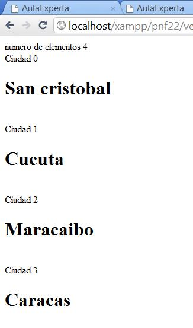

1.Dado un array formado por 4 nombre de ciudad "San Cristóbal","Cucuta","Maracaibo","Caracas" crear un página web similar a la siguiente utilzando bucles para recorrer vectores y las funciones que estimes necesarias.

Te en cuenta que debes respetar el formato.

2.Vectores asociativos

Crear dos array asociativos con los siguiente elementos

("2222222X" => "Pepe" ,"3333333X" =>"Manuel", "4444444X" => "José", "5555555X" => "Rosa")

("2222222X" => "Pérez" ,"3333333X" =>"Jiménez", "4444444X" => "Martínez", "5555555X" => "Rodríguez )

Y crear un programa PHP embebido en HTML que te muestre una tabla donde cada una de las filas contenga el nombre y los apellidos de cada uno de los DNI que deberás obtener de los vectores (todo en diferentes columnas).

3.Dado el siguiente array (‘roberto’,’juan’,’marta’,’moria’,’martin’,’jorge’,’miriam’,’nahuel’,’mirta’). Realizar un programa en PHP que lo recorra y genere un nuevo array con aquellos nombres que comiencen con la letra m.Nota:Deberéis buscar una función en la lista de funciones relacionadas con cadena.

4. Dado un array enumerativo de 10 elementos de números enteros (sin coma decimal), encontrar el máximo de todos esos números usando una estructura iterativa(bucle) y mostrarlo por pantalla.

5. Partiendo en un array vacío y utilizando una estructura iterativa añade a ese array los 10 primeros múltiplos de 77. Una vez has rellenado el array mostrar el contenido del mismo en un lista HTML numerada .
